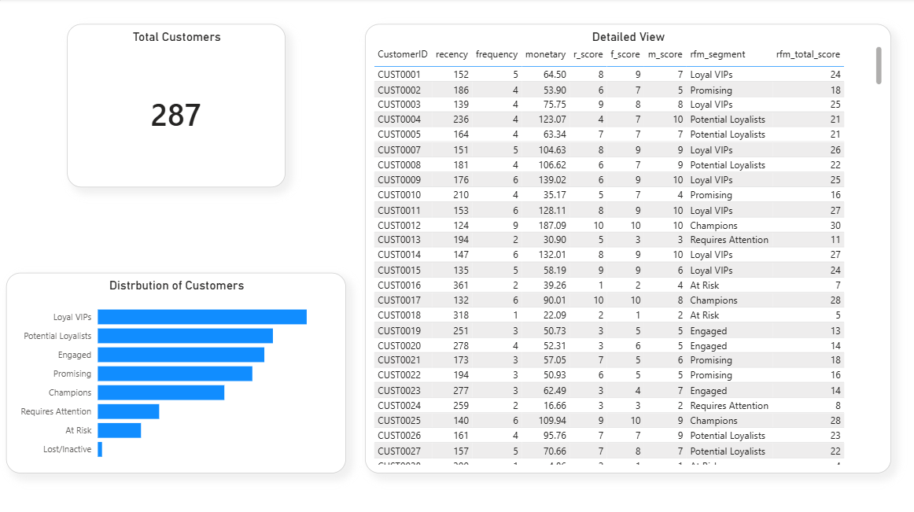

# Customer Segmentation using RFM Analysis

## Project Overview

This project uses SQL and Power BI to segment customers based on purchasing behaviour using RFM analysis.

RFM stands for:

- Recency: how recently a customer purchased
- Frequency: how often a customer purchased
- Monetary: how much a customer spent

The final dashboard helps identify high-value customers, loyal customers, and customers at risk of churn.

## Tools Used

- SQL / Google Big Query
- Power BI
- Excel

## Dashboard



## Objectives

- Segment customers using RFM scoring
- Identify high-value customers
- Detect customers at risk of churn
- Support targeted marketing decisions

## Repository Structure

```text
customer-segmentation-rfm-powerbi/
│
├── data/
├── sql/
├── powerbi/
├── images/
└── insights/
